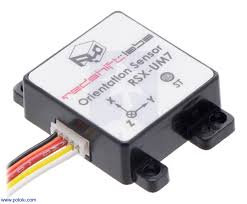

# This is the source for UM7 driver for STM32

The communication to the UM7 IMU is through Serial RS-232 UART. The uart libraries used are on this git hub [Kugle embedded](https://github.com/mindThomas/Kugle-Embedded)
## Installation 

STMCubeMX IDE is used to specify the clock source for the periphirial in the input-output map. 

System Workbench IDE based on eclipse is used for coding. 

## UM7 IMU Product

 
[UM7 IMU](https://redshiftlabs.com.au/product/um7-lt-orientation-sensor/)
[Datasheet](https://redshiftlabs.com.au/wp-content/uploads/2018/02/um7_datasheet_v1-6_10.1.2016.pdf)
